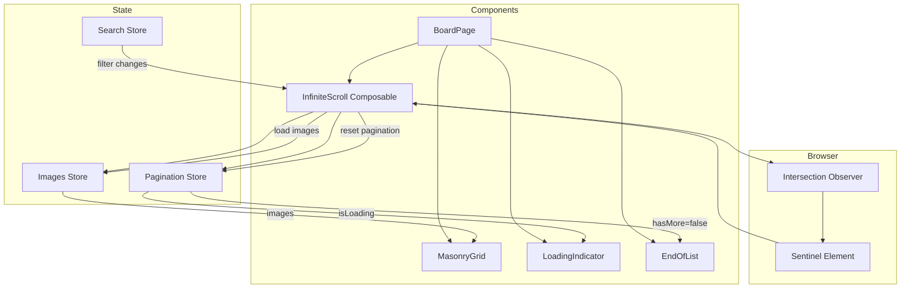
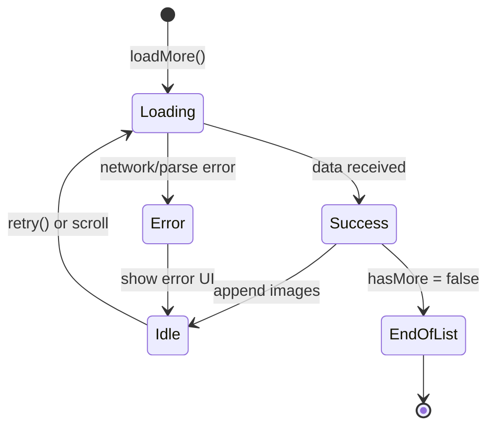

# Design Document: Infinite Scroll

## Overview

Этот документ описывает архитектуру и дизайн системы бесконечного скролла для SnapBoard. Система использует Intersection Observer API для эффективного отслеживания позиции скролла и автоматической подгрузки изображений по мере прокрутки пользователем.

## Architecture



## Components and Interfaces

### 1. Pagination Types

```typescript
// types/pagination.ts

/**
 * Состояние пагинации
 */
export interface PaginationState {
  page: number
  pageSize: number
  hasMore: boolean
  isLoading: boolean
  error: string | null
}

/**
 * Параметры запроса страницы
 */
export interface PageRequest {
  page: number
  pageSize: number
  boardId?: string
  query?: string
  tags?: string[]
  sortBy?: string
}

/**
 * Ответ с пагинированными данными
 */
export interface PaginatedResponse<T> {
  items: T[]
  page: number
  pageSize: number
  totalItems: number
  totalPages: number
  hasMore: boolean
}

/**
 * Конфигурация Infinite Scroll
 */
export interface InfiniteScrollConfig {
  pageSize?: number
  threshold?: number  // pixels before sentinel to trigger load
  initialLoad?: boolean
}

export const DEFAULT_INFINITE_SCROLL_CONFIG: InfiniteScrollConfig = {
  pageSize: 12,
  threshold: 100,
  initialLoad: true
}
```

### 2. useInfiniteScroll Composable

```typescript
// composables/useInfiniteScroll.ts

interface UseInfiniteScrollOptions {
  boardId: string
  config?: InfiniteScrollConfig
}

interface UseInfiniteScrollReturn {
  // State
  items: ComputedRef<Image[]>
  isLoading: Ref<boolean>
  hasMore: Ref<boolean>
  error: Ref<string | null>
  page: Ref<number>
  
  // Actions
  loadMore: () => Promise<void>
  reset: () => void
  retry: () => Promise<void>
  
  // Observer
  sentinelRef: Ref<HTMLElement | null>
  observerActive: Ref<boolean>
}

export function useInfiniteScroll(options: UseInfiniteScrollOptions): UseInfiniteScrollReturn
```

### 3. Sentinel Component

```vue
<!-- components/infinite-scroll/Sentinel.vue -->
<template>
  <div 
    ref="sentinelRef" 
    class="infinite-scroll-sentinel"
    :class="{ 'infinite-scroll-sentinel--hidden': !active }"
  />
</template>
```

### 4. LoadMore Component (Loading + End State)

```vue
<!-- components/infinite-scroll/LoadMore.vue -->
<template>
  <div class="load-more">
    <!-- Loading state -->
    <div v-if="isLoading" class="load-more__loading">
      <BaseLoader size="medium" />
      <span>Загрузка...</span>
    </div>
    
    <!-- Error state -->
    <div v-else-if="error" class="load-more__error">
      <span>{{ error }}</span>
      <button @click="$emit('retry')">Повторить</button>
    </div>
    
    <!-- End of list -->
    <div v-else-if="!hasMore && itemCount > 0" class="load-more__end">
      <span>Все изображения загружены</span>
    </div>
  </div>
</template>
```

## Data Models

### Pagination Store Extension

```typescript
// store/images.ts - расширение существующего store

// Добавляемое состояние пагинации
const pagination = ref<PaginationState>({
  page: 1,
  pageSize: 12,
  hasMore: true,
  isLoading: false,
  error: null
})

// Новые actions
const fetchPagedImages = async (request: PageRequest): Promise<PaginatedResponse<Image>>
const appendImages = (newImages: Image[]): void
const resetPagination = (): void
const setLoadingState = (loading: boolean): void
const setError = (error: string | null): void
```

### Mock API Response Structure

```typescript
// Структура ответа от API (mock)
interface MockApiResponse {
  images: Image[]
  pagination: {
    page: number
    pageSize: number
    total: number
    hasMore: boolean
  }
}
```

## Correctness Properties

*A property is a characteristic or behavior that should hold true across all valid executions of a system-essentially, a formal statement about what the system should do. Properties serve as the bridge between human-readable specifications and machine-verifiable correctness guarantees.*

### Property 1: New images append without replacing existing

*For any* list of existing images and any new page of images, when new images are loaded successfully, the resulting list SHALL contain all original images followed by the new images, preserving the order of both.

**Validates: Requirements 1.3**

### Property 2: Duplicate load prevention during loading

*For any* state where isLoading is true, calling loadMore SHALL NOT trigger an additional load request. The system SHALL ensure only one load operation is in progress at any time.

**Validates: Requirements 1.4**

### Property 3: Page cursor increments on successful load

*For any* successful page load, the page number SHALL increment by exactly 1 from its previous value.

**Validates: Requirements 2.2**

### Property 4: Filter changes reset pagination

*For any* change to search query, tag filters, or sort order, the pagination state SHALL reset to page 1, hasMore SHALL be true, and the existing images list SHALL be cleared.

**Validates: Requirements 2.4, 5.1, 5.2, 5.3**

### Property 5: Error preserves existing images

*For any* error that occurs during loading, the existing images in the list SHALL remain unchanged. No images SHALL be removed or modified due to a load error.

**Validates: Requirements 6.3**

### Property 6: Loading indicator matches loading state

*For any* pagination state, the loading indicator visibility SHALL equal the isLoading flag value. When isLoading is true, indicator is visible; when false, indicator is hidden.

**Validates: Requirements 1.2, 3.1, 3.2**

### Property 7: End-of-list state when hasMore is false

*For any* state where hasMore is false and the images list is non-empty, the end-of-list message SHALL be displayed instead of the loading indicator.

**Validates: Requirements 4.1**

## Error Handling

### Error States

1. **Network Error**: Отображается сообщение об ошибке с кнопкой "Повторить"
2. **Empty Response**: Устанавливается hasMore = false, отображается конец списка
3. **Invalid Data**: Логируется ошибка, сохраняются существующие данные

### Error Recovery Flow



### Error Message Format

```typescript
interface LoadError {
  type: 'network' | 'parse' | 'unknown'
  message: string
  retryable: boolean
}
```

## Testing Strategy

### Unit Tests

Unit тесты фокусируются на конкретных примерах и edge cases:

1. **Initial state**: Проверка начального состояния пагинации
2. **Empty board**: Обработка доски без изображений
3. **Single page**: Доска с количеством изображений меньше pageSize
4. **Observer cleanup**: Отключение observer при unmount

### Property-Based Tests

Property-based тесты используют библиотеку **fast-check** для генерации случайных входных данных и проверки инвариантов:

1. **Append invariant**: Для любого списка существующих изображений и новой страницы, append сохраняет все существующие элементы
2. **Reset invariant**: Для любого изменения фильтров, состояние сбрасывается корректно
3. **Error invariant**: Для любой ошибки, существующие данные сохраняются
4. **Loading guard**: Для любого состояния загрузки, повторные вызовы игнорируются

### Test Configuration

```typescript
// Конфигурация для property-based тестов
const PBT_CONFIG = {
  numRuns: 100,  // минимум 100 итераций
  seed: undefined  // случайный seed для воспроизводимости
}
```

### Test File Structure

```
frontend/
├── composables/
│   ├── useInfiniteScroll.ts
│   └── __tests__/
│       └── useInfiniteScroll.test.ts  // unit + property tests
├── store/
│   └── __tests__/
│       └── images.pagination.test.ts  // pagination logic tests
```
